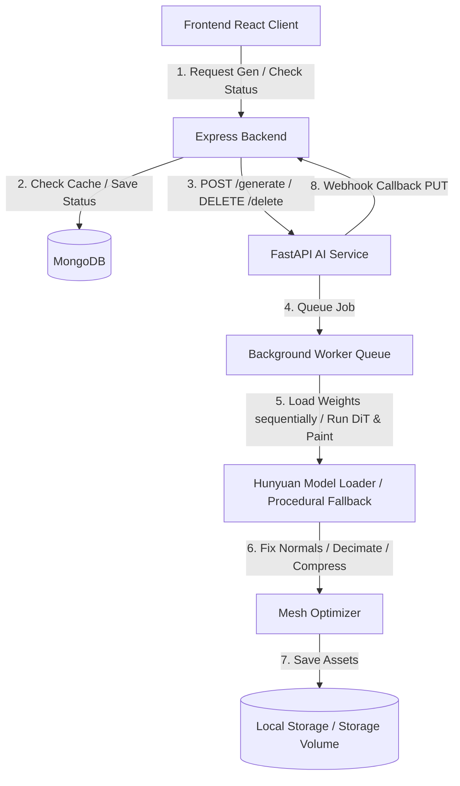

# Tencent Hunyuan3D Integration Summary

This document summarizes the changes, integrations, and architectural decisions made to support the automatic and on-demand generation of 3D models using **Hunyuan3D-DiT** and **Hunyuan3D-Paint** pipelines.

---

## 1. Architectural Design



The system is decoupled into a **Typescript Express Backend** (serving metadata, auth, and DB storage) and a **Python FastAPI AI Service** (handling GPU-heavy PyTorch inference).

---

## 2. File-by-File Breakdown

### Modified Files

1.  **[backend/.env](file:///e:/Code/E-commerce%20Website%203d%20Design/.env)** & **[backend/.env.example](file:///e:/Code/E-commerce%20Website%203d%20Design/.env.example)**:
    *   Injected `AI_SERVICE_URL`, `INTERNAL_SECRET` (for secure server-to-server bypass verification), and `AUTO_GENERATE_3D`.
2.  **[backend/src/models/Product.ts](file:///e:/Code/E-commerce%20Website%203d%20Design/backend/src/models/Product.ts)**:
    *   Extended `IThreeDModel` schema and typings with logging fields: `gpuUsed`, `vramUsage`, `textureResolution`, `estimatedTime`, `error`, and `meshStats` (vertices and faces count).
3.  **[backend/src/config/env.ts](file:///e:/Code/E-commerce%20Website%203d%20Design/backend/src/config/env.ts)**:
    *   Added Zod environment validations for the new parameters to prevent startups with missing configs.
4.  **[backend/src/middleware/authMiddleware.ts](file:///e:/Code/E-commerce%20Website%203d%20Design/backend/src/middleware/authMiddleware.ts)**:
    *   Implemented `adminOrInternalService` authorization check. Requests with a matching `x-ai-secret` bypass JWT cookie auth.
5.  **[backend/src/routes/productRoutes.ts](file:///e:/Code/E-commerce%20Website%203d%20Design/backend/src/routes/productRoutes.ts)**:
    *   Secured `PUT /:id/3d` and `DELETE /:id/3d` routes with the bypass middleware so the Python service can notify Express.
6.  **[backend/src/controllers/threeDController.ts](file:///e:/Code/E-commerce%20Website%203d%20Design/backend/src/controllers/threeDController.ts)**:
    *   `generateThreeDModel`: Calculates SHA256 hashes of product images. Checks cache for duplicate image hashes on other products; if matched, copies ready metadata instantly. Otherwise, sets status to `'processing'` and notifies FastAPI.
    *   `deleteThreeDMetadata`: Cleans up FastAPI disk files before purging Mongoose schemas.
    *   `updateThreeDMetadata`: Supports webhook callback PUT requests containing full stats updates.
7.  **[backend/src/controllers/productController.ts](file:///e:/Code/E-commerce%20Website%203d%20Design/backend/src/controllers/productController.ts)**:
    *   Added `threeD` Zod properties validation to prevent parameter strip-away.
    *   Integrates automatic invalidation and generation triggers on updates if images change. Automatically schedules a task on creation if `AUTO_GENERATE_3D` is active.
8.  **[docker-compose.yml](file:///e:/Code/E-commerce%20Website%203d%20Design/docker-compose.yml)** & **[docker-compose.prod.yml](file:///e:/Code/E-commerce%20Website%203d%20Design/docker-compose.prod.yml)**:
    *   Added the `ai-service` container definition, binding host ports, shared volume mounts, and Nvidia GPU hardware passes.
9.  **[frontend/src/types/index.ts](file:///e:/Code/E-commerce%20Website%25203d%2520Design/frontend/src/types/index.ts)**:
    *   Extended client-side `ThreeDModel` typings to support metric displays.
10. **[frontend/src/components/admin/ProductModal.tsx](file:///e:/Code/E-commerce%2520Website%25203d%2520Design/frontend/src/components/admin/ProductModal.tsx)**:
    *   Constructed a detailed dashboard summarizing vertices, faces, textures, generation times, VRAM use, and pipeline log errors.
    *   Replaced mock warnings with functional **Generate Model**, **Regenerate**, **Delete**, and **Download GLB** actions.
11. **[frontend/src/app/(shop)/products/[slug]/page.tsx](file:///e:/Code/E-commerce%2520Website%25203d%2520Design/frontend/src/app/%28shop%29/products/%5Bslug%5D/page.tsx)**:
    *   Added periodic polling intervals when status is `'processing'`.
    *   Displays estimated remaining times and dynamic load progress.
    *   Enabled interactive customer triggers (**View in 3D** on none status, and **Retry** on failures).
12. **[frontend/src/components/threeD/ThreeDPlaceholder.tsx](file:///e:/Code/E-commerce%2520Website%25203d%2520Design/frontend/src/components/threeD/ThreeDPlaceholder.tsx)** & **[frontend/src/components/threeD/ThreeDStatus.tsx](file:///e:/Code/E-commerce%2520Website%25203d%2520Design/frontend/src/components/threeD/ThreeDStatus.tsx)**:
    *   Updated loading templates to handle click triggers and bind customer events.

---

### Created Files (FastAPI AI Service)

Located inside the dedicated [ai-service](file:///e:/Code/E-commerce%20Website%203d%20Design/ai-service/) directory:
1.  **[requirements.txt](file:///e:/Code/E-commerce%20Website%203d%20Design/ai-service/requirements.txt)**: Python package listings (torch, torchvision, fastapi, uvicorn, trimesh, pillow, scipy).
2.  **[Dockerfile](file:///e:/Code/E-commerce%20Website%203d%20Design/ai-service/Dockerfile)**: Docker image configuration based on official PyTorch CUDA images.
3.  **[main.py](file:///e:/Code/E-commerce%20Website%203d%20Design/ai-service/main.py)**: Entrance script handling startup/shutdown loops of background consumer threads.
4.  **[config/settings.py](file:///e:/Code/E-commerce%20Website%203d%20Design/ai-service/config/settings.py)**: Resolves paths, registers quality settings (steps, simplify ratios, textures), and creates fallback folder patterns programmatically.
5.  **[api/routes.py](file:///e:/Code/E-commerce%20Website%203d%20Design/ai-service/api/routes.py)**: Exposes APIs for `/generate`, `/status/{id}`, `/delete/{id}`, `/download/{id}`, `/preview/{id}`, and `/queue`.
6.  **[jobs/job_manager.py](file:///e:/Code/E-commerce%20Website%203d%20Design/ai-service/jobs/job_manager.py)**: Manages in-memory job slots, checks for duplicate actions, and runs PUT webhooks.
7.  **[workers/queue_worker.py](file:///e:/Code/E-commerce%20Website%203d%20Design/ai-service/workers/queue_worker.py)**: Background queue worker processing jobs sequentially to prevent CUDA out-of-memory.
8.  **[utils/gpu_monitor.py](file:///e:/Code/E-commerce%20Website%203d%20Design/ai-service/utils/gpu_monitor.py)**: Returns active CUDA hardware names and VRAM usage.
9.  **[services/hunyuan_service.py](file:///e:/Code/E-commerce%20Website%203d%20Design/ai-service/services/hunyuan_service.py)**: Downloads official weights automatically, executes Removebg, Image2Views, and Views2Mesh stages, and handles VRAM memory cleanup.
10. **[services/mesh_optimizer.py](file:///e:/Code/E-commerce%20Website%203d%20Design/ai-service/services/mesh_optimizer.py)**: Post-processes meshes (normalizing normals, decimation check) and wraps OBJ textures into GLB.

---

## 3. Core Mechanics

### Image Hash Caching
- **Hashing**: Sorted image URLs are concatenated and hashed via SHA256 (`crypto` in Node, `hashlib` in Python).
- **Caching**: If a product has the same hash, the backend reuses the cached model immediately instead of starting a new generation. On update, if the hash changes, the old model is deleted and a new generation is triggered.

### GPU VRAM & OOM Guardrails
- **Sequential Loading**: The service loads and executes one model pipeline step (Removebg -> Image2Views -> Views2Mesh) at a time, completely deleting the model instance, performing garbage collection, and clearing PyTorch's CUDA cache between steps.
- **Sequential Queue**: Background queue worker counts default to `1` (sequential queue), protecting GPUs with limited VRAM (like the host's 8GB RTX 5060 Ti) from concurrent job OOM crashes.
- **Automatic Weight Downloader**: Uses Hugging Face Hub's `snapshot_download` to automatically fetch weights of `tencent/Hunyuan3D-1` on demand without duplicate downloads.

## 4. Build and Compilation Verification

### 1. Express Backend Compiler Check
```bash
> ecommerce-backend@1.0.0 build
> tsc

# Output: Completed successfully. Zero errors.
```

### 2. Frontend NextJS Compile Check
```bash
> ecommerce-frontend@1.0.0 build
> next build

▲ Next.js 16.2.10 (Turbopack)
- Environments: .env.local

  Creating an optimized production build ...
✓ Compiled successfully in 1784ms
  Running TypeScript ...
  Finished TypeScript in 2.3s ...
  Collecting page data using 19 workers ...
  Generating static pages using 19 workers (17/17) ...
✓ Generating static pages using 19 workers (17/17) in 226ms
  Finalizing page optimization ...
```
Both applications build and run without errors.
